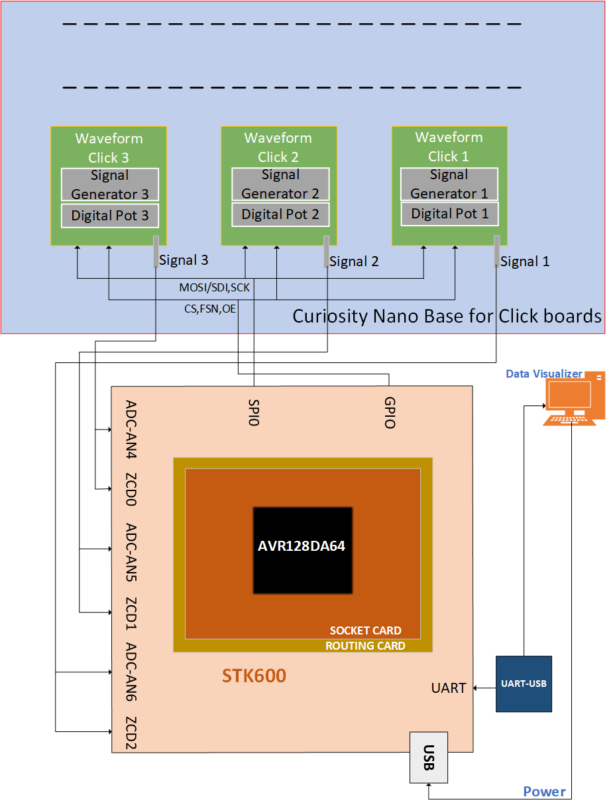
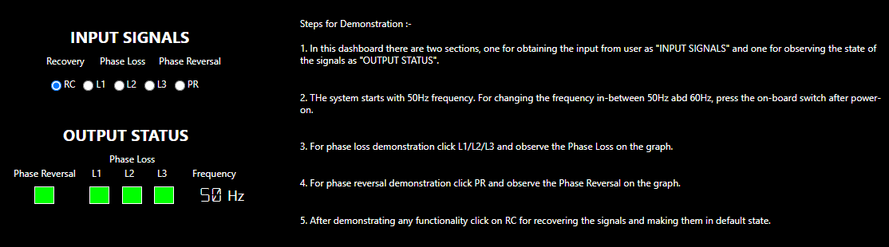
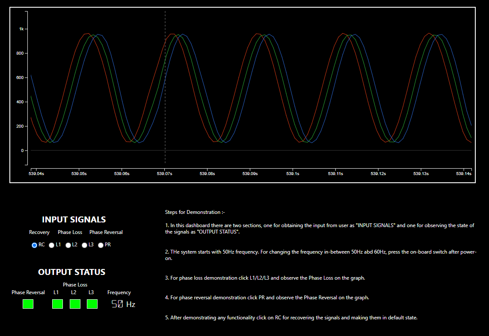

<!-- Please do not change this html logo with link -->

# Phase Sequence Detection of Three-Phase AC Supply

The AVR® DA family of microcontrollers (MCU) are peripheral rich, high performance and low-power 8-bit MCU devices. The built-in Zero-Cross Detector (ZCD), high-resolution Analog-to-Digital Converter (ADC) and timer peripherals are essential for realizing phase sequence detection applications.

The application demonstrator showcases the phase sequence detection and phase loss detection on emulated three phase AC supply using AVR128DA64 microcontroller.

## Related Documentation  
Phase Sequence Detection of Three-Phase AC Supply demonstration and implementation is discussed in the <a href="https://microchip.com/DS00003607" rel="nofollow">AN3607 - Phase Sequence Detection of Three-Phase AC Supply</a>.

The demonstration is implemented with both AVR128DA64 and AVR128DA48 microcontrollers and it is available on Microchip Discover -

* <a href="https://mplab-discover.microchip.com/v2/item/com.microchip.code.examples/com.microchip.ide.project/com.microchip.subcategories.modules-and-peripherals.analog.adc-modules.adc/com.microchip.mcu8.mplabx.project.avr128da48-phase-sequence-detection-of-ac-supply-mplab/2.0.1?view=about&dsl=avr128da48+AND+Phase" rel="nofollow">AVR128DA48 Phase Sequence Detection application code example using MPLAB</a>
* <a href="https://mplab-discover.microchip.com/v2/item/com.microchip.code.examples/com.microchip.ide.project/com.microchip.subcategories.modules-and-peripherals.analog.adc-modules.adc/com.microchip.mcu8.studio.project.avr128da48-phase-sequence-detection-of-ac-supply-studio/1.0.2?view=about&dsl=avr128da48+AND+Phase" rel="nofollow">AVR128DA48 Phase Sequence Detection application code example using Atmel Studio</a>
* <a href="https://mplab-discover.microchip.com/v2/item/com.microchip.code.examples/com.microchip.ide.project/com.microchip.subcategories.modules-and-peripherals.analog.adc-modules.adc/com.microchip.mcu8.studio.project.avr128da64-phase-sequence-detection-of-ac-supply-studio/1.0.2?view=about&dsl=avr128da64+AND+Phase" rel="nofollow">AVR128DA64 Phase Sequence Detection application code example using Atmel studio</a>

## Software Used 

* <a href="https://www.microchip.com/mplab/mplab-x-ide" rel="nofollow">MPLAB® X IDE</a> v6.25 or newer
* <a href="https://www.microchip.com/mplab/compilers" rel="nofollow">MPLAB® XC8 compiler</a> v3.00 or newer
* <a href="https://www.microchip.com/mplab/mplab-code-configurator" rel="nofollow">MPLAB® Code Configurator (MCC)</a> v5.5.3 or newer
* <a href="https://packs.download.microchip.com" rel="nofollow">Microchip AVR-Dx Series Device Support</a> v2.7.321 or newer
* <a href="https://www.microchip.com/mplab/avr-support/data-visualizer" rel="nofollow">MPLAB® Data Visualizer</a> v1.4.1926 or newer
* ADC MCC Melody Driver v5.0.0
* SPI MCC Melody Driver v5.1.0
* TCA MCC Melody Driver v7.1.0
* USART MCC Melody Driver v10.2.1
* VREF MCC Melody Driver v4.1.0
* ZCD MCC Melody Driver v4.0.4

## Hardware Used

* <a href="https://www.microchip.com/en-us/product/avr128da64" rel="nofollow">AVR128DA64</a>
* <a href="https://www.microchip.com/developmenttools/ProductDetails/AC164162" rel="nofollow">Curiosity Nano Base for Click boardsTM</a>
* <a href="https://www.mikroe.com/waveform-click" rel="nofollow">3x Waveform Clicks</a>
* SMA male cable
* <a href="http://ww1.microchip.com/downloads/en/DeviceDoc/STK600-AVR-Flash-MCU-Starter-Kit-Users-Guide-DS40001904D.pdf" rel="nofollow">STK600 Board</a>
* <a href="https://www.microchip.com/Developmenttools/ProductDetails/ATSTK600-SC14" rel="nofollow">Socket card</a> (STK600-TQFP64-2)
* Routing card (STK600-RC064AVR-108)
  
## Setup

The following steps explain the procedure for setting up the hardware for three-phase sequence detection using AVR128DA64 microcontroller. The AVR device is connected to the STK600 using an innovative routing (STK600-RC064AVR-108) and socket (STK600-TQFP64-2) card sandwich system, which routes the I/O pins from the device to the appropriate hardware. Figure 1 below the listed instructions shows the hardware setup used for the application demo.
* Insert AVR128DA64 MCU in the microcontroller slot of the socket card.

  **Note:** For proper orientation while inserting the microcontroller, refer to the marking on the AVR128DA64 MCU.

* Insert three Waveform Click boards in the three mikroBUSTM slots available on Curiosity Nano Base board
* Connect the SMA output of the Waveform Clicks to the respective microcontroller I/O pins using the SMA connectors. Refer <a href="https://microchip.com/DS00003607" rel="nofollow">Appendix</a> section in AN3607 for more information about the specific microcontroller I/O pins to be used.
* Detach the Waveform Click 2 OEN pin from the mikroBUS slot2 PWM2 pin
* Detach the Waveform Click 3 CS pin from the mikroBUS slot3 CS3 pin
* Connect the PWM2 pin of mikroBUS slot2 to pin PB5, and CS3 pin of mikroBUS slot3 to pin PB4
* Connect the Curiosity Nano board to a host computer (PC) using the standard micro B USB cable
* Using a female-female jumper wire, connect the PC7 pin (PORT C) of the STK600 board to the SW0 pin (Switches) of the STK600 board
* Using a female-female jumper wire, connect the VTG and GND pins of the STK600 board to the VCC and GND pins of the Curiosity Nano adapter board, respectively
* Connect the UART 1 pins PC0 and PC1 (Tx and Rx) from the STK600 board to PC through the USB-UART convertor
* Connect the Micro USB-B cable to power the STK600 board
* Press the SW0 button on the STK600 board to select the appropriate frequency (50Hz/60Hz) for the emulated three-phase AC signal 

  </a>
   <b>Figure 1.</b> Demonstration Hardware Setup 

## Data Visualizer Configuration
The Data Visualizer tool is used as a graphical user interface to demonstrate the application by displaying the emulated three-phase supply waveforms, output status and for receiving the user inputs.
The preconfigured data streamer and custom dashboard files are necessary for the Data Visualizer configuration, and can be found in the firmware package. The below steps given for data visualizer configuration uses these files to get the setup ready.

The Data Visualizer modules used in the demonstration are:
* Serial Port (Baud Rate – 230400)
* Graph 
* Custom Dashboard (Custom Dashboard file is given for the demonstration) 
  * Element Label
  * Element Signal
  * Radio Group
* Data Streamer (Data Streamer file is given for the demonstration)  

Refer to the <a href="https://ww1.microchip.com/downloads/aemDocuments/documents/DEV/ProductDocuments/UserGuides/MPLAB_DATA_VISUALIZER_1_4_1926.pdf" rel="nofollow">Data Visualizer User Guide</a> for more information.

The demo uses an emulated three-phase AC supply to showcase the essential features of the application. To emulate the AC power supply three waveform clicks are used in the application.

### Custom Dashboard: User Inputs and Output Indicators  

The Data Visualizer custom dashboard is customized for this application, user input and output elements are listed below:     

#### User Inputs

-	Recover three-phase supply from faults
-	Insert phase loss fault on L1 phase
-	Insert phase loss fault on L2 phase
-	Insert phase loss fault on L3 phase
-	Insert phase reversal (PR) fault

#### Application Output Indicators

-	Three-phase waveforms (using graphs)
-	Phase reversal (using status indicator)
-	Phase loss status (using status indicator)
-	Operating frequency (using sequence output)

The figure below shows the Data Visualizer custom dashboard and input, output elements.

  
   <b>Figure 2.</b> User Inputs and Output Status  

#### Demo instructions

1. In this dashboard, there are two sections: one for obtaining the user input ('INPUT SIGNALS'), and one for observing the state of the signals ('OUTPUT STATUS').
2. The starting frequency is 50 Hz. To change the frequency value to be between 50 and 60 Hz, press the on-board switch after power on.
3. For a demo of the phase loss, click L1, L2 or L3 and observe the Phase Loss segment on the graph.
4. For a demo of phase reveal, click PR and observe the Phase Reveal segment on the graph.
5. After checking out any of the available demos, click RC under Recovery to set everything back to default state.

## Demo Operation

1. Configure the serial port for communication with the Curiosity Nano board.
2. Configure the Data Streamer for interfacing dashboard window with the serial port by clicking on <b>IMPORT</b> tab. The Data Streamer configuration ``(data-streamer-config.txt)`` file is available in the example firmware folder.
3. Configure the graph window for displaying the emulated three-phase supply AC waveforms, generated by the Waveform Clicks.
4. Configure the custom dashboard window to display the output and to receive user inputs by clicking the Load option in the dashboard window. The custom dashboard ``(custom-dashboard-config)`` design file is available in the example firmware folder.
5. Connect the hardware and prepare the demo setup as per the instructions provided in the [Setup](#setup) section. 
6. Click <b>Serial Port Connect</b> button.
7. Using push button SW0 on the Curiosity Nano board, select the appropriate frequency for the three-phase signal. The selected frequency is displayed on the custom dashboard window.
8. Zoom in or out on the graph from the custom dashboard by clicking the +/- magnifier symbol on the left side of the graph window.
9. Insert phase loss fault by clicking the L1 radio button on the dashboard, which disables the L1 signal out of the three-phase signal to emulate phase loss input.
10. Insert phase loss fault by clicking the L2 radio button on the dashboard, which disables the L2 signal out of the three-phase signal to emulate phase loss input.
11. Insert phase loss fault by clicking the L3 radio button on the dashboard, which disables the L3 signal out of the three-phase signal to emulate phase loss input.
12. Insert phase reversal by clicking the PR radio button on the dashboard, which changes the sequence of the three-phase signal.
13. The status indicators have two states: Red - phase reversal, phase loss, and Green - no phase reversal, no phase loss.

Figure 2 shows the Data Visualizer dashboard illustrating the Phase Sequence Detection of the three-phase AC supply.

  
   <b>Figure 3.</b> Data Visualizer Custom Dashboard 

